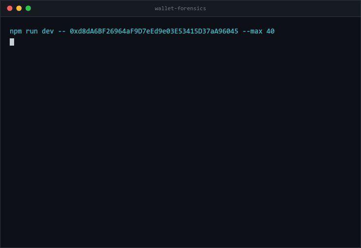

# wallet-forensics

[](https://github.com/daronthedragon/wallet-forensics/actions/workflows/ci.yml)

A forensic report for any **Ethereum, Base, Arbitrum, Optimism, Polygon or Solana** address. Realized PnL, fees burned, value extracted by MEV bots, outstanding approval risk — and the number no portfolio tracker will show you: **what your bags are actually worth if you tried to sell them.**

One CLI, six chains, no account required.

```bash
git clone https://github.com/daronthedragon/wallet-forensics && cd wallet-forensics && npm install
```

```bash
npm run dev -- 0xd8dA6BF26964aF9D7eEd9e03E53415D37aA96045
```

<p align="center">
  
</p>

_A real run. The gap between those first two numbers is the whole point._

## Why this exists

Every portfolio tracker computes `balance × spot price` and calls it your net worth.

For anything outside the top few hundred tokens, that number is fiction. Spot price comes from the last trade — which may have been $40 against a pool holding $3,000 of liquidity. Selling a "$50,000" position into that pool does not produce $50,000. It produces maybe $4,000 and a chart that looks like a cliff.

This tool route-quotes the actual sale and reports the gap. It also surfaces the other things that quietly cost you money and never appear on a dashboard: the unlimited approval you granted in 2021 and forgot, the sandwich bots taxing every swap, the gas you burned on transactions that reverted.

## What it reports

| | |
|---|---|
| **Exit liquidity** | Route-simulated sale of every position. Nominal vs. realizable, price impact, and the largest sale that stays under 5% impact. |
| **Realized & unrealized PnL** | Weighted-average cost basis, reconstructed from transaction history. |
| **MEV extraction** | Sandwich attacks against your swaps, with the attacker's transactions and estimated value taken. |
| **Approval risk** | Outstanding allowances on Ethereum, token-account delegates on Solana, scored by what could actually be taken right now. |
| **Fee archaeology** | Lifetime fees in native units, what they cost at the time, what that currency is worth today, and how much went to reverted transactions. |
| **Activity profile** | Wallet age, counterparties, protocols used, failure rate. |
| **Ranked regrets** | Every finding above, sorted by dollar cost. |

## Install

```bash
git clone https://github.com/YOUR_USERNAME/wallet-forensics
cd wallet-forensics
npm install
cp .env.example .env
```

Requires Node 20+.

### Configuration

Everything has a working public default except Ethereum transaction history.

| Variable | Needed for | Notes |
|---|---|---|
| `ETHERSCAN_API_KEY` | EVM transaction history, PnL, MEV | **One key covers every EVM chain** — their V2 API is unified. Free tier is plenty. Without it, history falls back to Blockscout, which needs no key. |
| `ETH_RPC_URL`, `BASE_RPC_URL`, `ARBITRUM_RPC_URL`, `OPTIMISM_RPC_URL`, `POLYGON_RPC_URL` | Balances, approvals, MEV, exit quotes | Public defaults work. Approval scanning needs an endpoint permitting unbounded `eth_getLogs` — public nodes usually reject it, and the tool falls back to deriving approvals from history and says so. |
| `SOLANA_RPC_URL` | Everything Solana | The public endpoint is heavily rate limited. Helius or Triton strongly recommended. |
| `COINGECKO_API_KEY` | Faster pricing | Optional. Raises rate limits considerably. |

#### What the demo above actually ran

The recording is a real run against a real address, not a mock-up:

<details>
<summary>Same output as text</summary>

```
npm run dev -- 0xd8dA6BF26964aF9D7eEd9e03E53415D37aA96045 --max 40

  WALLET FORENSICS
  generated 2026-08-20 21:20:22 UTC

  ────────────────────────────────────────────────────────────────────────────

  Portfolio (nominal)       $720,878
  Portfolio (realizable)    $70,506  90.2% evaporates on exit
  Realized PnL              $0
  Unrealized PnL            +$28,454
  Net PnL                   +$28,454
  Fees burned               $0

  ─ WHAT COST YOU THE MOST ───────────────────────────────────────────────────

  1. Illiquid position: WHITE  $422,473
     Shows as $422,538 but would realize $65.01 — 100% price impact to exit.
     Only $0.0000 can be sold cleanly.
```

</details>

One honest caveat about it. History came from Blockscout with no API key, which
is the default path. The exit-liquidity quotes did **not** come from the default
RPC — public endpoints refuse the `eth_call` the Uniswap quoter needs often
enough that two consecutive attempts returned `quote unavailable`. The run shown
used a dedicated endpoint via `ETH_RPC_URL`.

That refusal is itself worth seeing, because of how the tool reports it:

```
    WHITE          $422,538 → quote unavailable
```

Not `$0`. Not "unsellable". A quote that was refused is unknown, and unknown is
excluded from the loss ranking rather than counted as a total loss. Every zero
in a report carries the reason it is a zero — the tool never says "no risky
approvals" when what happened was "the approval scan was refused". Those are
very different claims, and conflating them is how a security tool gets someone
hurt.

Add a free Etherscan key and any dedicated RPC endpoint and the same command fills in.

## Pricing and speed

Token prices come from DefiLlama, which takes a hundred addresses per request
and needs no key. CoinGecko's unkeyed tier refuses any request carrying more
than one contract address, so pricing through it alone costs one throttled
call per token — and an address that has been airdropped spam for years holds
thousands.

Prices below DefiLlama's reported confidence threshold are discarded rather
than shown, because a thin or manipulated pool produces a confident-looking
number nobody could actually transact at. CoinGecko remains the fallback for a
small remainder; beyond that, tokens stay unpriced, which every downstream
figure already treats as unknown rather than zero.

Measured on an address holding **6,757 tokens**: the run previously never
completed and reported only the native balance behind a rate-limit warning. It
now finishes in about two minutes with 310 tokens priced and a portfolio total
of $563k rather than $12.7k.

## Caching

Historical daily prices are written to disk permanently, because a price for a
day that has already ended cannot change. Nothing volatile is cached — spot
prices and balances are always fetched, since serving a stale one confidently
is the failure this tool exists to avoid.

It matters because the unkeyed CoinGecko tier allows roughly one call every
2.2 seconds and a wallet with real history asks about hundreds of distinct
days. Measured on the same run with identical inputs: **12s warm against 49s
with `--no-cache`**, 14 hits and no misses.

Cache lives in `~/.cache/wallet-forensics/`, overridable with
`WALLET_FORENSICS_CACHE_DIR` and disabled with `WALLET_FORENSICS_NO_CACHE=1`.

## Use it from an agent

Works with any MCP client, or as a plain CLI.

### Cursor, Windsurf, Zed, Continue, VS Code

After `npm install && npm run build`:

```json
{
  "mcpServers": {
    "wallet-forensics": {
      "command": "node",
      "args": ["/absolute/path/to/wallet-forensics/dist/mcp/server.js"]
    }
  }
}
```

Exposes one tool, `analyze_wallet`. The server is implemented directly against
the MCP wire format rather than with the official SDK, which keeps the
dependency list to the two clients that actually do chain work.

### Any other agent

Point it at [`AGENTS.md`](AGENTS.md) and let it call the CLI. That file is the
vendor-neutral brief: what the tool reports, when to invoke it, how to read the
output, and the interpretation rules that matter.

### No build, no dependencies

The sibling [wallet-forensics-skill](https://github.com/daronthedragon/wallet-forensics-skill)
runs the same analysis with zero dependencies and no build step, and ships a
Claude `SKILL.md` as well. It shares this repo's analysis core verbatim, under
a CI drift gate.

## Usage

```bash
# Ethereum
npm run dev -- 0xd8dA6BF26964aF9D7eEd9e03E53415D37aA96045

# Solana
npm run dev -- 7xKXtg2CW87d97TXJSDpbD5jBkheTqA83TZRuJosgAsU

# Several EVM chains at once
npm run dev -- 0xd8dA6BF... --chain base,arbitrum --verbose

# Every EVM chain
npm run dev -- 0xd8dA6BF... --all-evm

# EVM and Solana in one report
npm run dev -- 0xd8dA6BF... 7xKXtg2CW... --verbose

# Shareable HTML
npm run dev -- 0xd8dA6BF... --html report.html

# Machine-readable
npm run dev -- 0xd8dA6BF... --json > report.json
```

| Flag | Effect |
|---|---|
| `--chain <list>` | Comma-separated chains: `ethereum,base,arbitrum,optimism,polygon,solana` |
| `--all-evm` | Analyze the address on every supported EVM chain |
| `--html <path>` | Write a self-contained HTML report (no external requests, works offline) |
| `--json [path]` | JSON to a file, or stdout if no path given |
| `--since <date>` | Only analyze activity from this date onward |
| `--max <n>` | Cap transactions fetched per chain (default 3000) |
| `--no-mev` | Skip sandwich detection — much faster |
| `--no-liquidity` | Skip routing quotes |
| `-v` | Progress on stderr |

## How it works

### Cost basis without a historical price oracle

The hard part of on-chain PnL isn't the accounting — it's knowing what anything was worth the moment it moved. Fetching a historical price for every token on every day is thousands of API calls, and most long-tail tokens have no price history at all.

So the value is inferred from the transaction itself. A swap has two sides; if either side is a stablecoin or the chain's native asset, that side reveals the dollar value of the whole trade, and it's attributed to the other side. This covers the overwhelming majority of real trades and needs **one price lookup per day** instead of one per token per day.

Transfers with no anchor — an airdrop of an unknown token, a transfer between your own wallets — are counted and excluded rather than guessed at. The report tells you how many.

### Sandwich detection

The structural signature is narrow enough to detect reliably: the same address appears immediately before **and** after your transaction in the same block, and all three touch a common pool.

Extracted value is measured from the attacker's own token flow — they enter a position in the front-run and exit it in the back-run, so their net gain in WETH or a stablecoin across the pair is what they took. When that can't be measured, the detection is reported with the value left blank rather than estimated. Confidence is labeled `high` / `medium` / `low` on every event.

### Exit liquidity

Full-size sale quoted through Uniswap V3 (probing every fee tier) on Ethereum and Jupiter on Solana. When full exit exceeds 5% price impact, a binary search finds the largest sale that stays under it.

### Adding a chain

**Another EVM chain** is one entry in the `EVM_CHAINS` table in [`src/config.ts`](src/config.ts): chain id, RPC, native asset, CoinGecko ids, Uniswap V3 quoter, wrapped native, stablecoin numeraire, Blockscout instance, explorer. Nothing else changes — the adapter, analysis and reporting layers all read from that table.

**A non-EVM chain** means implementing one interface in [`src/adapters/types.ts`](src/adapters/types.ts) — history, balances, approvals, MEV, sell quotes. The analysis and reporting layers work on a normalized model and need no changes.

## Architecture

```
src/
├── adapters/          chain-specific data access
│   ├── types.ts       the interface a chain must implement
│   ├── evm.ts         viem + Etherscan V2 + Uniswap V3 Quoter
│   └── solana.ts      web3.js + Jupiter
├── analysis/          chain-agnostic, operates on normalized types
│   ├── pnl.ts         weighted-average cost basis
│   ├── mev.ts         sandwich detection
│   ├── liquidity.ts   route-quoted exit simulation
│   ├── fees.ts        lifetime fee archaeology
│   ├── activity.ts    wallet profile
│   └── regrets.ts     ranking by dollar cost
├── pricing/           CoinGecko with day-resolution caching
├── report/            terminal + self-contained HTML
└── forensics.ts       pipeline orchestration
```

Every stage degrades independently. If approval scanning fails because your RPC caps `eth_getLogs`, you still get PnL, fees, and liquidity — with a note explaining what's missing and why. Nothing is silently dropped.

## Tests

```bash
npm test
```

Covers cost-basis inference (stablecoin anchoring, native anchoring, unvalued transfers), fee accounting, regret ranking, and renderer output including HTML escaping.

## Limitations

Worth being straight about:

- **Cost basis is inferred, not authoritative.** Trades with no stablecoin or native leg are excluded from PnL. Don't file taxes with this.
- **Exit liquidity is a point-in-time quote.** It moves with the market and ignores CEX depth entirely.
- **MEV detection finds sandwiches**, not JIT liquidity, backrunning-only, or cross-domain extraction.
- **Solana MEV value is not attributed.** Detection is structural; profit attribution requires modelling pool state per DEX.
- **Exit liquidity is Uniswap V3 only** on EVM. A token whose liquidity lives on Curve, Balancer, a V2 pair or an L2-native DEX reads as illiquid. "No route found" means *this tool found no route*.
- **Bridged and cross-wallet transfers** look like unexplained inflows. They'll show up as unvalued.

## License

MIT
